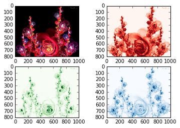
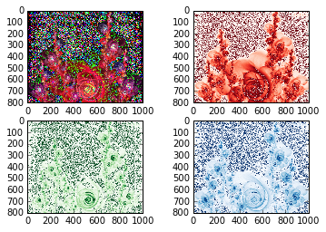

UECM3033 Assignment #2 Report
========================================================

- Prepared by: **ANG HUANG YING **
- Tutorial Group: T2

--------------------------------------------------------

## Task 1 --  $LU$ Factorization or SOR method

The reports, codes and supporting documents are to be uploaded to Github at: 

https://github.com/anghuangying/UECM3033_assign2.git

Explain your selection criteria here.

The condition is set to be np.count_nonzero(A) > 1/2*len(A). Sparse matrix is a matrix where most of the elements are zeros and allows special techniques to take advantage to reduce both the storage and work required in solving a linear system. Therefore, LU method will be chosen if the non-zero is greater than half of the length of matrix A. For iterative methods, SOR method  are adequate to use the sparse matrix.

Explain how you implement your `task1.py` here.

In task 1 , implement function of lu, sor and solve are created. For LU method, two matrix will be created with is the lower triangular matrix and upper triangular matrix whereby A=LU, thus Ax=LUx=b and therefore it will be define into Ly=b and Ux= y. The x matrix will be calculated after getting the y matrix. For the SOR method, assume the omega as 1.03 which is within the range of 1 < omega < 2 that will converge for any initial vector if A matrix is symmetric and positive definite. If omega is greater than 2 , SOR method will diverge. If 0 < omega<1, SOR method converges but the convergence rate is slower than the Gauss-Seidal method. For the iteration limit needed to be set so that it will not loop until infinity time. In this task, the iteration limit is set to be 10. Begin the iteration by assuming the first x as zero vector. Then substitute each x we found to calculate the new x and iterate until the iteration limit. In order to find the precise answer, assign sol equal to np.linalg.solve(A,b) else the answer will not be accurate.

---------------------------------------------------------

## Task 2 -- SVD method and image compression

Put here your picture file(flowers.jpg)

How many non zero element in $\Sigma$?
All the elements (R,G,B) in $\Sigma$ are non zero. 

Put here your lower and better resolution pictures. Explain how you generate
these pictures from `task2.py`.

Original Image

Lower Resolution Picture $\Sigma_{30}$

Better Resolution Picture $\Sigma_{200}$

The figure above shows the first 30 and 200 non zero elements kept in $\Sigma$. Initially, uploaded the new image into github to generate the picture. Read the image to get the 3 matrices which consists of r,g and b that each of it is a 3 dimension matrix. Red matrix represent Ur,Sr and Vr, green matrix represent Ug,Sg,Vg and blue matrix represent Ub,Sb,Vb to find out the U,$\Sigma$ and V of the three matrices and therefore the scipy.linalg.svd is used. "plt.figure" is used to  plot the picture. Then, the numpy.count_nonzero is used to find out the non zero  elements in $\Sigma$. Moreover, compress the image to keep the first 30 non zero elements as in $\Sigma$ and set all other non zero elements to zero. This will formed a lower resolution matrix. A self define function is created for this purpose. Firstly, the purpose of using  Sr.copy is to copy the original  $\Sigma$ in order to avoid the loss of information and same goes to blue and green. After this only begin to keep the first n non zero elements and set others to zero by using Sr1[n:800]=np.zeros_like(Sr[n:800]).  Sr1 is needed to be change to dimension (800x1000) which is originally (800,1) by using sp.linalg.diagsvd. Thus, there is no dimensional error will occur when combine it to a matrix of U,$\Sigma$,V by dot multiplication. Dot multiplication of np.dot is performed to create a new matrix of $\Sigma$. The process is repeated for green and blue matrices. Another figure is plotted that shows a lower resolution after all the process. In the last part, a new better resolution can be constructed by calling the self define function again. 

What is a sparse matrix?

A sparse matrix is a matrix which most of the elements are zero and allows special techniques to take advantage to reduce both the storage and work required in solving a linear system. It would like to store and operate on only the non zero entries of the matrix, but such a policy is not necessarily a clear win in either storage or work. In this task, sparse matrix is formed when the first 30 elements of $\Sigma$ is kept and other elements are set to zero. Thus, it will create a lower resolution of pictures when combined with U and V by using dot multiplication as the dimension of $\Sigma$ is converted to (800,1000) which is consider as a large sparse matrix.

-----------------------------------

last modified: 11/3/2016
